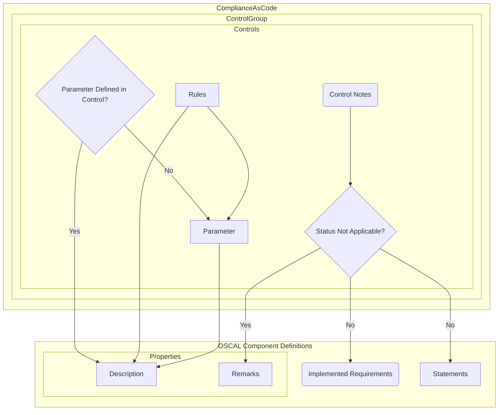

# oscal_authoring_demo
A repository to hold OSCAL content for demonstrations

# How is the ComplianceAsCode content transformed into an OSCAL Component Definition?

- The example control file used in this repository is [nist_ocp4](https://github.com/ComplianceAsCode/content/blob/master/controls/nist_ocp4.yml)

